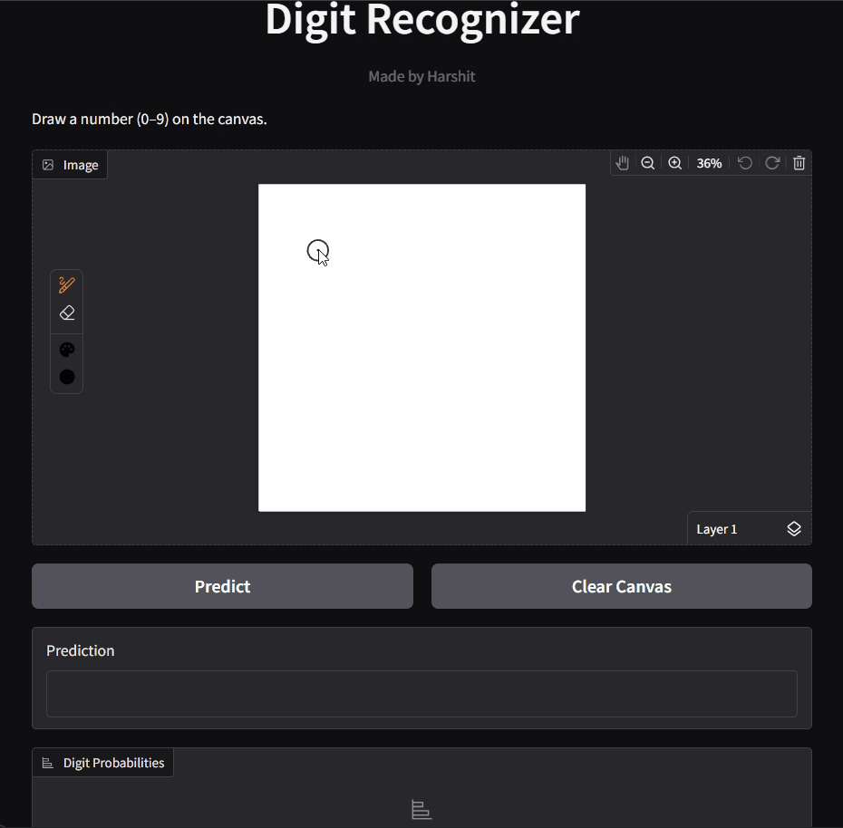

# Digit Recognizer


A real-time handwritten digit recognition web application built using a **Convolutional Neural Network (CNN)** trained on the **MNIST dataset**.

Users can draw digits (0–9) on an interactive canvas, and the AI model predicts the digit instantly along with prediction confidence and probability distribution.

---

## Application Demo


---

## Features

* Real-time handwritten digit recognition
* Interactive drawing canvas using **Gradio**
* CNN model trained on the **MNIST dataset**
* Automatic digit centering and preprocessing
* Live prediction while drawing
* Confidence score display
* Probability distribution for digits **0–9**
* Clear canvas functionality

---

## Technologies Used

* **Python**
* **TensorFlow / Keras**
* **Open cv**
* **NumPy**
* **SciPy**
* **Gradio** (for UI)
* **Git & GitHub**

---

## Model Comparison

During development, multiple models were explored for digit classification.

| Model                              | Accuracy | Notes                           |
| ---------------------------------- | -------- | ------------------------------- |
| Perceptron                         | ~85%     | Basic linear classifier         |
| Artificial Neural Network (ANN)    | ~95%     | Fully connected neural network  |
| Convolutional Neural Network (CNN) | ~99%     | Best performance for image data |

The **CNN model performed the best**, so it was used in the final application.

---

## Why CNN Performs Better Than ANN

Convolutional Neural Networks are designed specifically for image-based tasks.

Advantages of CNN:

* Captures **spatial features** of images
* Uses **convolutional filters** to detect patterns
* Requires fewer parameters than fully connected networks
* More robust to small shifts in handwritten digits

Because of these properties, CNN achieves higher accuracy for handwritten digit recognition.

---

## Model Performance

* **Training Accuracy:** ~99%
* **Validation Accuracy:** ~98%
* **Dataset:** MNIST Handwritten Digits
* **Input Size:** 28 × 28 grayscale image
* **Output:** Digit classification (0–9)
---
## Model Architecture
       Input Image (28 × 28 grayscale)
            ↓
      Conv2D Layer (32 filters, 3×3 kernel, ReLU activation)
            ↓
      MaxPooling Layer (2×2)
            ↓
      Conv2D Layer (64 filters, 3×3 kernel, ReLU activation)
            ↓
      MaxPooling Layer (2×2)
            ↓
      Flatten Layer
            ↓
      Dense Layer (ReLU activation)
            ↓
      Dropout Layer (0.5)
            ↓
      Output Layer (Softmax)
            ↓
      Digit Prediction (0–9)

## Application Workflow

      User draws digit
            ↓
      Image preprocessing (noise removal + centering)
            ↓
      Image resized to **28 × 28**
            ↓
      CNN model prediction
            ↓
      Digit and probability distribution displayed

---

## Run the Project

Clone the repository:

```
git clone https://github.com/harshit2537/Digit_Recognizer.git
```

Navigate to the project folder:

```
cd Digit_Recognizer
```

Install dependencies:

```
pip install -r requirements.txt
```

Run the application:

```
python app.py
```

Open in browser:

```
http://127.0.0.1:7860
```

---

## Author

**Harshit**

BCA Student | AI & Data Science Enthusiast

Passionate about building AI-powered applications and exploring machine learning technologies.
